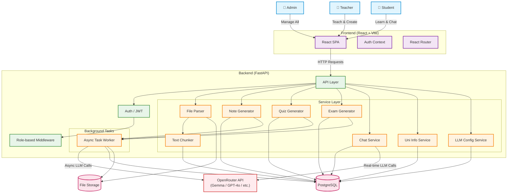

```mermaid
flowchart TD
    %% Actors
    Admin["👤 Admin"]
    Teacher["👤 Teacher"]
    Student["👤 Student"]

    %% Frontend
    subgraph Frontend["Frontend (React + Vite)"]
        UI[React SPA]
        AuthCtx[Auth Context]
        Router[React Router]
    end

    %% Backend
    subgraph Backend["Backend (FastAPI)"]
        API[API Layer]
        Auth[Auth / JWT]
        Middleware[Role-based Middleware]

        subgraph Services["Service Layer"]
            FileParser[File Parser]
            Chunker[Text Chunker]
            NoteGen[Note Generator]
            QuizGen[Quiz Generator]
            ExamGen[Exam Generator]
            ChatSvc[Chat Service]
            UniInfoSvc[Uni Info Service]
            LLMConfigSvc[LLM Config Service]
        end

        subgraph Tasks["Background Tasks"]
            TaskQueue[Async Task Worker]
        end
    end

    %% External
    DB[(PostgreSQL)]
    FS[(File Storage)]
    OpenRouter["OpenRouter API\n(Gemma / GPT-4o / etc.)"]

    %% Connections - Actors to Frontend
    Admin -->|Manage All| UI
    Teacher -->|Teach & Create| UI
    Student -->|Learn & Chat| UI

    %% Frontend to Backend
    UI -->|HTTP Requests| API
    API --> Auth
    Auth --> Middleware

    %% Backend Internal Flow
    API --> FileParser
    API --> NoteGen
    API --> QuizGen
    API --> ExamGen
    API --> ChatSvc
    API --> UniInfoSvc
    API --> LLMConfigSvc

    FileParser --> Chunker
    Chunker --> DB
    NoteGen --> DB
    QuizGen --> DB
    ExamGen --> DB
    ChatSvc --> DB
    UniInfoSvc --> DB
    LLMConfigSvc --> DB

    FileParser --> FS
    NoteGen --> TaskQueue
    QuizGen --> TaskQueue
    ExamGen --> TaskQueue

    TaskQueue -->|Async LLM Calls| OpenRouter
    ChatSvc -->|Real-time LLM Calls| OpenRouter

    TaskQueue --> DB
    TaskQueue --> FS

    %% Styling
    classDef actor fill:#e1f5fe,stroke:#0288d1,stroke-width:2px
    classDef frontend fill:#f3e5f5,stroke:#7b1fa2,stroke-width:2px
    classDef backend fill:#e8f5e9,stroke:#388e3c,stroke-width:2px
    classDef service fill:#fff3e0,stroke:#f57c00,stroke-width:2px
    classDef external fill:#ffebee,stroke:#d32f2f,stroke-width:2px
    classDef storage fill:#fce4ec,stroke:#c2185b,stroke-width:2px

    class Admin,Teacher,Student actor
    class UI,AuthCtx,Router frontend
    class API,Auth,Middleware backend
    class FileParser,Chunker,NoteGen,QuizGen,ExamGen,ChatSvc,UniInfoSvc,LLMConfigSvc,TaskQueue service
    class OpenRouter external
    class DB,FS storage
```
