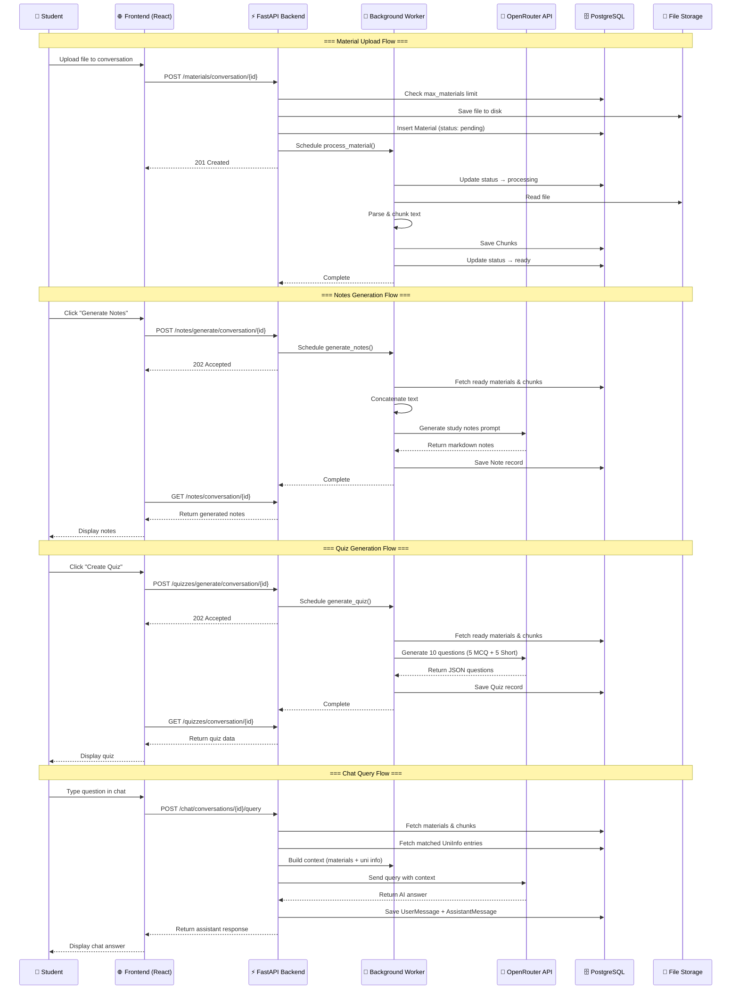

```mermaid
sequenceDiagram
    participant Student as 👤 Student
    participant UI as 🌐 Frontend (React)
    participant API as ⚡ FastAPI Backend
    participant Task as 🔧 Background Worker
    participant LLM as 🤖 OpenRouter API
    participant DB as 🗄️ PostgreSQL
    participant FS as 💾 File Storage

    Note over Student,FS: === Material Upload Flow ===

    Student->>UI: Upload file to conversation
    UI->>API: POST /materials/conversation/{id}
    API->>DB: Check max_materials limit
    API->>FS: Save file to disk
    API->>DB: Insert Material (status: pending)
    API->>Task: Schedule process_material()
    API-->>UI: 201 Created

    Task->>DB: Update status → processing
    Task->>FS: Read file
    Task->>Task: Parse & chunk text
    Task->>DB: Save Chunks
    Task->>DB: Update status → ready
    Task-->>API: Complete

    Note over Student,FS: === Notes Generation Flow ===

    Student->>UI: Click "Generate Notes"
    UI->>API: POST /notes/generate/conversation/{id}
    API->>Task: Schedule generate_notes()
    API-->>UI: 202 Accepted

    Task->>DB: Fetch ready materials & chunks
    Task->>Task: Concatenate text
    Task->>LLM: Generate study notes prompt
    LLM-->>Task: Return markdown notes
    Task->>DB: Save Note record
    Task-->>API: Complete

    UI->>API: GET /notes/conversation/{id}
    API-->>UI: Return generated notes
    UI-->>Student: Display notes

    Note over Student,FS: === Quiz Generation Flow ===

    Student->>UI: Click "Create Quiz"
    UI->>API: POST /quizzes/generate/conversation/{id}
    API->>Task: Schedule generate_quiz()
    API-->>UI: 202 Accepted

    Task->>DB: Fetch ready materials & chunks
    Task->>LLM: Generate 10 questions (5 MCQ + 5 Short)
    LLM-->>Task: Return JSON questions
    Task->>DB: Save Quiz record
    Task-->>API: Complete

    UI->>API: GET /quizzes/conversation/{id}
    API-->>UI: Return quiz data
    UI-->>Student: Display quiz

    Note over Student,FS: === Chat Query Flow ===

    Student->>UI: Type question in chat
    UI->>API: POST /chat/conversations/{id}/query
    API->>DB: Fetch materials & chunks
    API->>DB: Fetch matched UniInfo entries
    API->>Task: Build context (materials + uni info)
    API->>LLM: Send query with context
    LLM-->>API: Return AI answer
    API->>DB: Save UserMessage + AssistantMessage
    API-->>UI: Return assistant response
    UI-->>Student: Display chat answer
```
