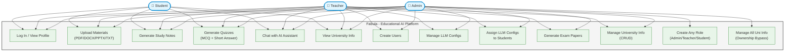

```mermaid
flowchart TD
    subgraph Fabula["Fabula - Educational AI Platform"]
        UC1["Log In / View Profile"]
        UC2["Upload Materials\n(PDF/DOCX/PPTX/TXT)"]
        UC3["Generate Study Notes"]
        UC4["Generate Quizzes\n(MCQ + Short Answer)"]
        UC5["Chat with AI Assistant"]
        UC6["View University Info"]
        UC7["Create Users"]
        UC8["Manage LLM Configs"]
        UC9["Assign LLM Configs\nto Students"]
        UC10["Generate Exam Papers"]
        UC11["Manage University Info\n(CRUD)"]
        UC12["Create Any Role\n(Admin/Teacher/Student)"]
        UC13["Manage All Uni Info\n(Ownership Bypass)"]
    end

    Student(["👤 Student"])
    Teacher(["👤 Teacher"])
    Admin(["👤 Admin"])

    Student --> UC1
    Student --> UC2
    Student --> UC3
    Student --> UC4
    Student --> UC5
    Student --> UC6

    Teacher --> UC1
    Teacher --> UC2
    Teacher --> UC3
    Teacher --> UC4
    Teacher --> UC5
    Teacher --> UC6
    Teacher --> UC7
    Teacher --> UC8
    Teacher --> UC9
    Teacher --> UC10
    Teacher --> UC11

    Admin --> UC1
    Admin --> UC2
    Admin --> UC3
    Admin --> UC4
    Admin --> UC5
    Admin --> UC6
    Admin --> UC7
    Admin --> UC8
    Admin --> UC9
    Admin --> UC10
    Admin --> UC11
    Admin --> UC12
    Admin --> UC13

    classDef actor fill:#e1f5fe,stroke:#0288d1,stroke-width:2px
    classDef system fill:#f5f5f5,stroke:#616161,stroke-width:2px
    classDef useCase fill:#e8f5e9,stroke:#388e3c,stroke-width:1px

    class Student,Teacher,Admin actor
    class Fabula system
    class UC1,UC2,UC3,UC4,UC5,UC6,UC7,UC8,UC9,UC10,UC11,UC12,UC13 useCase
```
